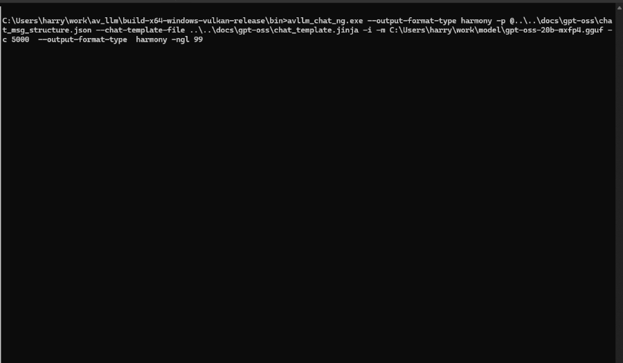

# Tools
## Function calling


## Structured Output



# Configurable reasoning effort

there are 3 levels: low, medim, high

- provide the questions: sum from 1 to 100

- The result with low reasoning level

``` text
<|channel|>analysis<|message|>User asks: "sum 1 to 100". Likely want sum of integers 1 through 100. That's 5050. Provide answer.<|end|><|start|>assistant<|channel|>final<|message|>The sum
 of all integers from 1 to 100 is:
\[
1 + 2 + 3 + \dots + 100 = \frac{100 \times 101}{2} = 5050
\]
```

- the result medium reasoning level 

``` text
<|channel|>analysis<|message|>The user asks: "sum from 1 to 100". They likely want the sum of integers from 1 to 100. That is 5050. They mig
ht want the calculation. So answer: 5050. Provide explanation.<|end|><|start|>assistant<|channel|>final<|message|>The sum of all integers fr
om 1 100 is
\[
1 + 2 + 3 + \dots + 100 = \frac{100 \times 101}{2} = 5050.
\]

So the total is **5050**.
```

- the result with high reasoning level

``` text
<|channel|>analysis<|message|>The user says: "sum from 1 to 100". They likely want the sum of integers from 1 to 100. That sum is 5050. They
 might want the calculation or the result. The user didn't specify format. So we can respond with the sum: 5050. We can also show the formul
a: n(n+1)/2 = 100*101/2 = 5050. So answer: 5050. Probably just that.<|end|><|start|>assistant<|channel|>final<|message|>The sum of the integ
ers from 1 to 100 is  
\[
1 + 2 + 3 + \dots + 100 = \frac{100 \times 101}{2} = 5050.
\]
```

# Chain of Thought (CoT)
Found it very useful for debuging and understanding the model's reasoning process.
This text is not shown to the user, but really userful for developers.


The below is cut-off of function calling, where 'leve' is typo
``` json
{
  "function": {
    "name": "set_brightness_level",
    "description": "set brightness level, set current level (0-255)",
...................
        "leve": {
          "type": "string",
        }
..................
      "required": [
        "name",
        "level"
      ]
    }
  }
}
```


## Help to detect the typo in the function calling
``` text
The function signature expects "leve?" but spelled incorrectly. We'll pass "leve": "100".<|end|><|start|>assistant<|channel|>commentary
 to=functions.set_brightness_level <|constrain|>json<|message|>{"name":"kitchen light","leve":"100"}
```

## Help to detect why the function calling failed
``` text 
<|channel|>analysis<|message|>The user says "set level to 123". They didn't specify device name. We need to ask for clarification. According
 to instructions, we should ask for clarification.<|end|><|start|>assistant<|channel|>final<|message|>IΓÇÖm ready to set the brightness leve
l, but I need to know which device youΓÇÖd like to adjust. Could you please tell me the device name (e.g., light 01, living room, etc.)?

```

# Tools
## function calling
TBD
## 


## Reference
* https://openai.com/index/gpt-oss-model-card/
* https://cdn.openai.com/pdf/419b6906-9da6-406c-a19d-1bb078ac7637/oai_gpt-oss_model_card.pdf
* https://cookbook.openai.com/articles/openai-harmony

