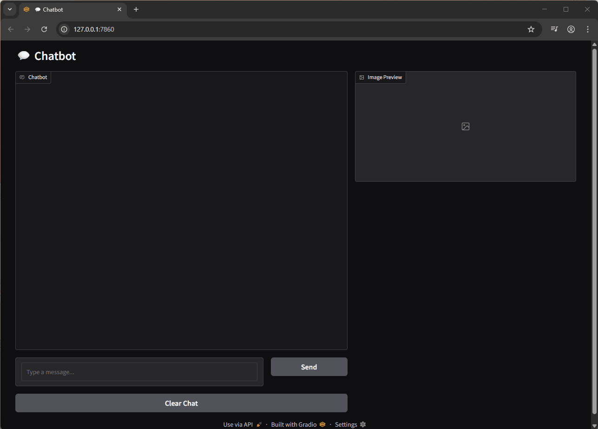
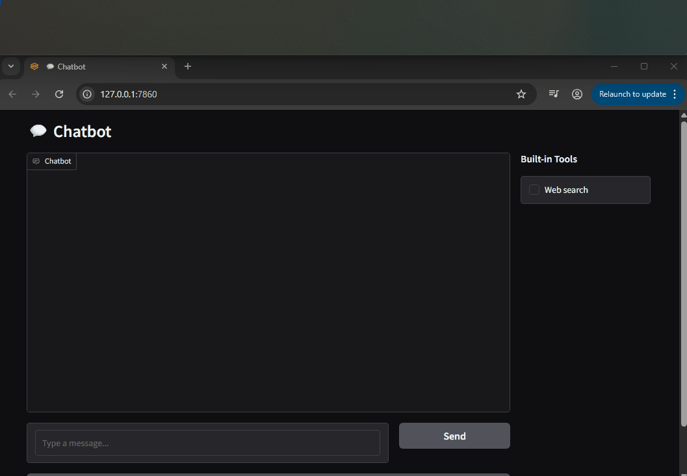
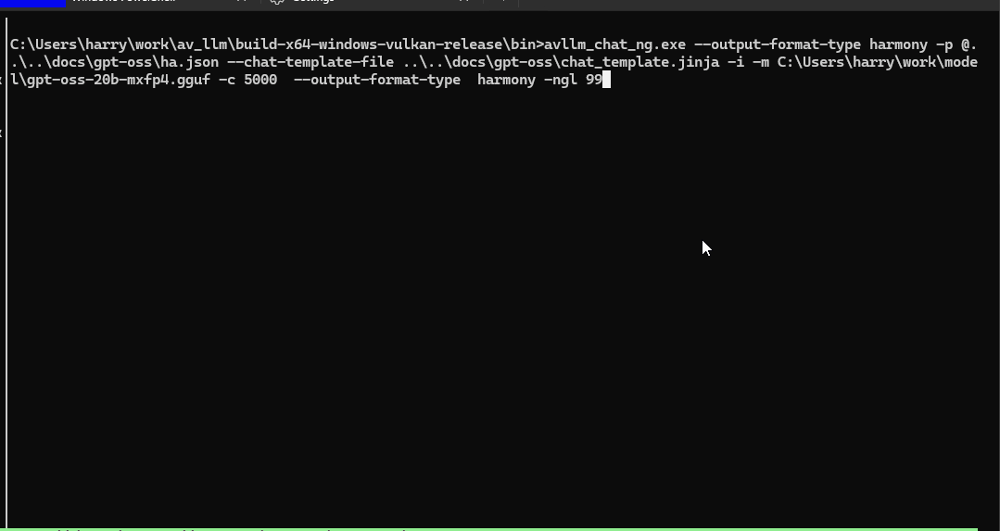
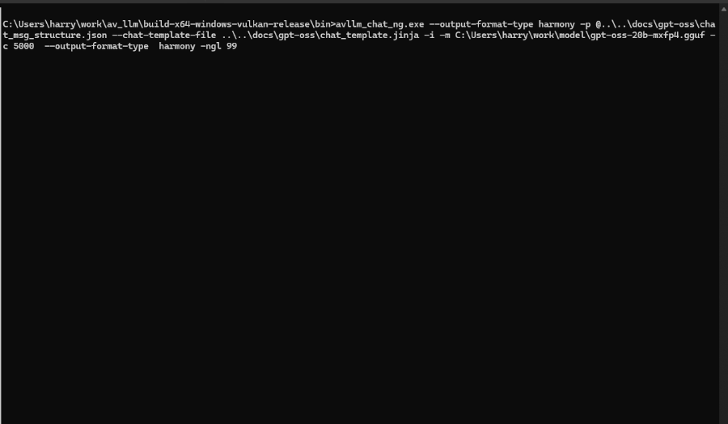
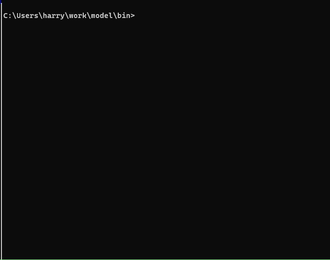

## Hot
- Explore the features of gpt-oss model [gpt-oss capability findings](docs/model_gpt_oss.md)

## Overview
- Develop a C++ server for serving the LLM inference
- LLM inference engine based on [llama.cpp]
  - Pre-allocate the number of context and share among requests
- Periodically sync with upstream [llama.cpp]
- Explore LLM Tasks: general chat, function calling, embedding, sentence similarity, semantic search, etc.

## Demos
* GPT-OSS (Python tools)


* GPT-OSS (Web browsing)


* GPT-OSS (Function calling)


<details>
<summary>
GPT-OSS (Structured Output)
 </summary>

</details>
  
<details>
<summary>
Demo chat with Jan AI agent
 </summary>

</details>

<details>
<summary>
Demo function calling (with Qwen model)
 </summary>

 </details>

 <details>
 <summary>
Demo Code Completion
</summary>  

</details>

## What it has?
### [Endpoint] C++ server for serving LLM inference
<details>
 <summary>
[open-ai] Completions
  </summary>
 
   - [x] Default
   - [x] stream
</details>
<details>
 <summary>
[open-ai] Chat completions
  </summary>
 
   - [x] Default
   - [x] stream
   - [ ] Image input
   - [x] function
   - [ ] Logbrobs
</details>
<details>
 <summary>
[open-ai] Models 
  </summary>
 
   - [x] list models  
   - [x] retrieve model 
   - [ ] delete a model
</details>

Embeddings 

<details>
 <summary>
ollama 
  </summary>
 
   - [x] /api/tags
   - [x] /api/show  
   - [x] /api/chat 
   - [ ] /api/generate
</details>

<details>
 <summary> FIM (Fill-In-Middle) </summary>
 
- [x] File-level 
- [ ] Rep-level
 </details>
 

## Models
[details](docs/model.md)

| Model                                                                                             | ~GB   | Tags          | Remark  |
|---------------------------------------------------------------------------------------------------|-------|---------------|---------|
| Qwen3-8B                                                                                          |       | think, MCP    |         |
| [Qwen3-4B](https://huggingface.co/Qwen/Qwen3-4B-GGUF)                                             | ~3 Gb |               | Q4, K_M |
| [Qwen2.5-Coder-3B-Q8_0-GGUF](https://huggingface.co/ggml-org/Qwen2.5-Coder-3B-Instruct-Q8_0-GGUF) |       | chat, coding, FIM   |         |
|                                                                                                   |       |               |         |

## work log 
| Date       | Work log                                                                 |
|------------|--------------------------------------------------------------------------|
| 2025-08-28 | Sync with upstream of [llama.cpp]                                                 |
| 2025-08-21 | Demo: GPT-OSS Web search                                                 |
| 2025-08-13 | Demo: GPT-OSS structured output, function-calling                        |
| 2025-08-09 | Demo: semantic search with sentence embedding and vector database        |
| 2025-08-08 | Demo the sentence similarity                                             |
| 2025-08-06 | Sync with upstream of [llama.cpp] and support gpt-oss                    |
| 2025-08-04 | LLM Inference: Pre-allocate the context and sharing amongs requests      |
| 2025-07-24 | Sync with upstream of [llama.cpp]                                        |
| 2025-07-23 | Finalize initial base version: server, command line                      |


### Some tools 
|Item                 |Brief                                              |link                           |
|-------------------- |-------------------------------------------------- |------------------------------ |
|gen                  |given input, generate the sequence of text         |[example/avllm_gen.cpp](example/avllm_gen.cpp) |
|chat                 |given chatML format, generate the sequence of text |[example/avllm_chat.cpp](example/avllm_chat.cpp) |
|embedding            |given input, generate a embedding vector           |[example/avllm_embedding.cpp](example/avllm_embedding.cpp) |
|sentence similarity  |given an query, search for similar sentence        |[example/avllm_sentence_similarity.cpp](example/avllm_sentence_similarity.cpp) | 
|semantic search      |spit a document into chunks, and search for similar chunks |[example/semantic_search/semantic_search.cpp](example/semantic_search/semantic_search.cpp) |


## Installation
<details>
<summary> Pre-built </summary>
# Pre-built 

 | OS      | Download link |
 |---------|---------------|
 | macOS   | T.B.U         |
 | Windows | T.B.U         |
 | Linux   | T.B.U         |


### GPU based package 
To take avantage of GPU's memory and computation.
Support various GPU's library/platform.

 | OS      | CUDA | VULKAN | SYCL |
 |---------|------|--------|------|
 | Windows |      |        |      |
 | Linux   |      |        |      |
 | macOS   | x    | x      | x    |

</details>

## Compilation

``` shell
T.B.U
```

## Main components
- Web UI: Provide a simple web UI interface to explore/experiment (borrowed from @llama.cpp project)
- CLI: An lightweight and simple command-line-interface
- A lightweight OpenAI API compatible server: [av_connect http server](https://github.com/avble/av_connect.git) in C++
- LLM Inference engine: by [llama.cp](https://github.com/ggerganov/llama.cpp.git)

## Future work
- Support more AI tasks
  
## Note
This is demonstration version, some issues or error checking is not fully validated.
<br>
Contact me via `avble.harry dot gmail.com` if any
